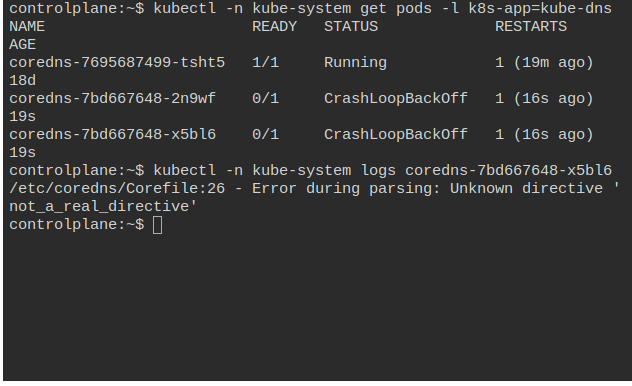
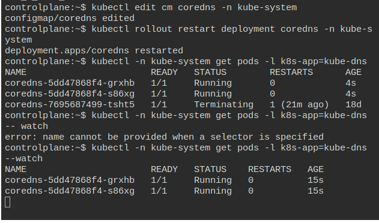

## Prod Issue: CoreDNS CrashLoop on Startup 

### [Issues are based on https://k8s-issues.purutuladhar.com/]

### What did Happen!?

Team Added a Custom Rule in the Corefile which had the Invalid Syntax resulting ==> CoreDNS failed to Start ! 

### Why CoreDNS is important ?!
- CoreDNS is responsible for the Service Discovery
- Enables Pods to communicate using DNS names
- Integrates with the K8s API Server and is updated with the Services and Endpoints

### Some Important Points to Notice
- CoreDNS runs as Deployment in kube-system ns with 2+ Replicas
- DNS Configuration is contreolled via the CoreFile
- Uses `Plugins`(it states how CoreDNS processes DNS queries) to handle DNS Logic.


### Steps to Replicate this Issue

1. Locate the ConfigMap ! 
[The CoreDNS config is not a physical file on your local system by default — it's stored in the CoreDNS ConfigMap in Kubernetes.] 

kubectl get cm coredns -n kube-system

2. Edit the ConfigMap
kubectl edit cm coredns -n kube-system

3. Add a custom rule / block that can interrupt the CoreDNS
```
# Append it to the CoreFile
invaild_block {
  not_a_real_directive	
}
```

4. Restart the CoreDNS Pods

```
kubectl rollout restart deployment coredns -n kube-system
```

5. Check for the CoreDNS Crash and getting into the CrashLoopBackOff
```
kubectl -n kube-system get pods -l k8s-app=kube-dns

kubectl -n kube-system logs <coredns-pod-name>
```

We can see an error like 
```
plugin/invalidblock: plugin not found
```

---

### Fix / Solution


1. Remove the Invalid Block from the CoreDNS Config Map

```
kubectl edit configmap coredns -n kube-system
```

2. Restart the CoreDNS:
```
kubectl rollout restart deployment coredns -n kube-system
```




