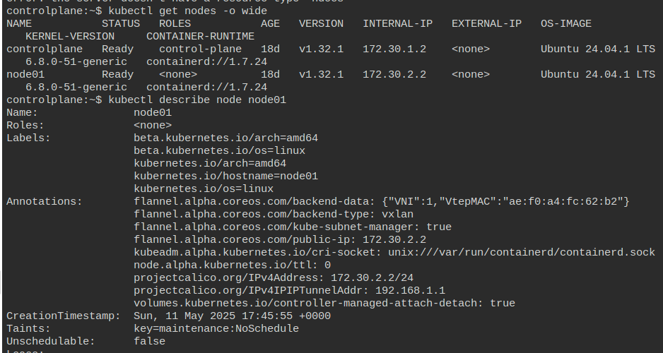
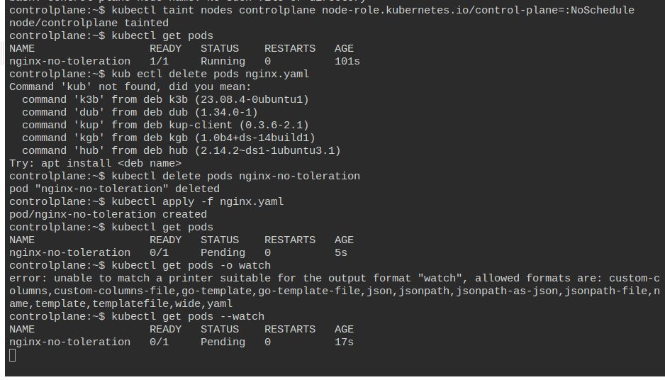
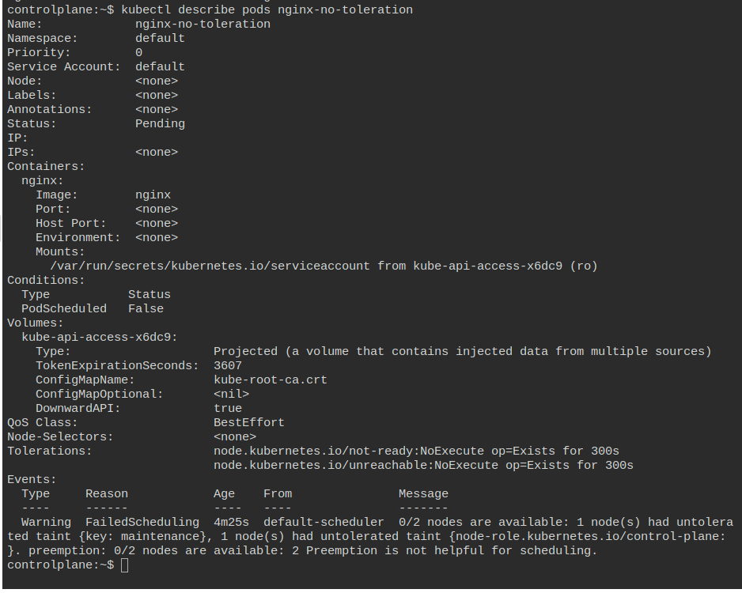
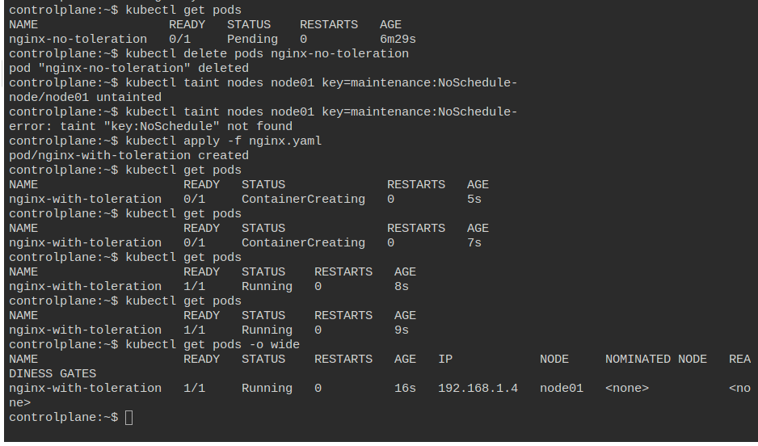

## Prod Issue: Misconfigured Taints Blocking Pod Scheduling 
    
### What did happen ?!

A user added taints (NoSchedule) to all nodes to isolate their app, but forgot to include tolerations in workloads. Other apps stopped working

Such same things can happen when having Maintaince Activity.

### Simulation Playground: `KillerKoda K8s Playground v1.32`


### Important Points to know about
- Taints are applied on `Nodes(Lock)`; While Tolerations are applied on the `Pods(Key)`.
- NoSchedule denotes `Strict Not Scheduling`, PreferNoSchedule denotes `Avoids Scheduling but not strict`, NoExecute denotes `Evicts already running POD and avoid entry to new Pods`
- Mainly used for the workload isolation eg: GPU Nodes, Infra Nodes.
- Even using both the Toleration and Taints doesnt gurantee that the Pods would lie in a particular Node. [Due to Insufficient Resources / Node Affinity Mismatch]
- Widely used in the `maintainance activity` of cluster.


### Steps to Replicate this Issue

1. Get the Nodes
```
kubectl get nodes -o wide
```

2. Apply the Taints on the node01 [Here having 2 node Cluster; 1 controlplane, 1 worker aka node01]

```
# Apply taint as NoSchedule
kubectl taint nodes node01 key=maintenance:NoSchedule
```


3. Check for the taint applied on Node
```
kubectl get nodes -o wide
```
**NOTE** - By default the Pods may get scheduled the onto the Control Plane in KillerKoda; So we may as well try to mark COntrol Plane as Unschedulable.

4. Marking the COntrolPlane as Unschedulable [Can avoid if Control Plane is already marked as Unschedulable]
```
kubectl taint nodes controlplane node-role.kubernetes.io/control-plane=:NoSchedule
```
5. Check for the Taints Applied on ControlPlane
```
kubectl describe nodes controlplane
```

6. Now add a sample pod file [nginx.yaml]
```
# nginx.yaml

apiVersion: v1
kind: Pod
metadata:
  name: nginx-no-toleration
spec:
  containers:
  - name: nginx
    image: nginx
```
7. Apply the nginx.yaml file
```
kubectl apply -f nginx.yaml
```

8. Check for if the Pods get scheduled!? 
```
# IT should NOT [PENDING STATE]
kubectl get pods -o wide

# Checking the Pod
kubectl describe pods nginx-no-toleration

# We will get error like this 
0/1 nodes are available: 1 node(s) had taint {key=maintenance}, that the pod didn't tolerate.
```






### Fix / Solution

1. Add Toleration to the Pod(Modifying the nginx.yaml file)
```
apiVersion: v1
kind: Pod
metadata:
  name: nginx-with-toleration
spec:
  containers:
  - name: nginx
    image: nginx
  tolerations:
  - key: "maintenance"
    operator: "Equal"
    value: "true"
    effect: "NoSchedule"
```
2. Now try to run the Pods and observe if the Pods are getting scheduled
```
kubectl apply -f nginx.yaml

kubectl get pods -o wide
```




